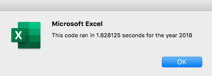
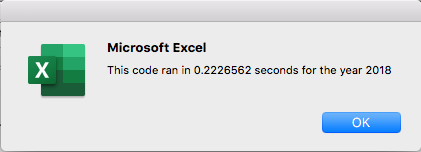

# Stock Analysis Overview

##Purpose
The purpose of the stock analysis was to find the return of investment on certain tickers in the market. We completed an initial attempt to get this information, and although it worked, it was not the most efficient analysis. So, we reworked the VBA code to find out if we could get the results but with a smoother code that ran faster. 

##Results

###Code
I created a chart to insert the ticker, ticker volume, and return for the data we pulled using our VBA code. To find the total volume for a ticker, I added all volume values with the code below:

	tickerVolumes(tickerIndex) = tickerVolumes(tickerIndex) + Cells(Row, 8).Value

To find the return, I used and equation that requires the ticker starting price and ending price. To find the starting price, I checked if the current row is the first row with the selected ticker index, if the condition is true, the value in column six of the row being inspected is our tickerStartingPrices value. 
I recreated a similar if statement to check if the current row is the last row with the selected ticker. If it is in fact the last row, I then increase the tickerIndex value by one.

	If Cells(Row, 1).Value = tickers(tickerIndex) And Cells(Row + 1, 1).Value <> 		tickers(tickerIndex) Then
            tickerEndingPrices(tickerIndex) = Cells(Row, 6).Value
            tickerIndex = tickerIndex + 1

The code we wrote to find starting and ending prices works because our spreadsheet data is ordered first by ticker, and then by oldest to newest date. I might have to rework the code not if the data is in a different order. 

The final step was to output the values into a table in a separate worksheet. To do that, I created a for loop. I activated the sheet where our values would go, and then I populated the code into the chart by using the tickerIndex to match each ticker to its volume, starting price, and ending price using arrays declared for each of these variables. I also had code that highlighted in red the tickers that did not perform well and in green the ones that had a return. 

The 12 tickers compared in this analysis did much better in 2017. All but on got a return on investment. Half of the tickers had at least 50% of return that year. The ticker performance in 2018 looked a lot different. Only 2 out of the 12 had a return.Tickers ENPH and RUN had a positive return on both years and seem like a good investment option based on this analysis. 

###Time
The refactored code took 0.2 seconds to run, while the original code took 1.8 seconds for the year 2018. So refactoring the code by using the arrays and index made it a lot faster.

Code run time before refactoring:

Code run time after refactoring: 

One thing to note is that the code usually takes the longest the firs time you run it, and there are slight decreases in time if you run it again. Therefore, the numbers I got above might not match exactly what other people get. 

##Summary

The advantages of refactoring code are a chance to polish your work by making it more readable and efficient. The downside is that it takes extra time and effort to get the same information. So, it has to be code that takes a really long time to run in order for the refactoring to be worth it. 

In this situation, we were able to get the refactored code to run 8 times faster than the original code. It was a huge improvement, but since we are comparing seconds it is hard to notice without measuring. 